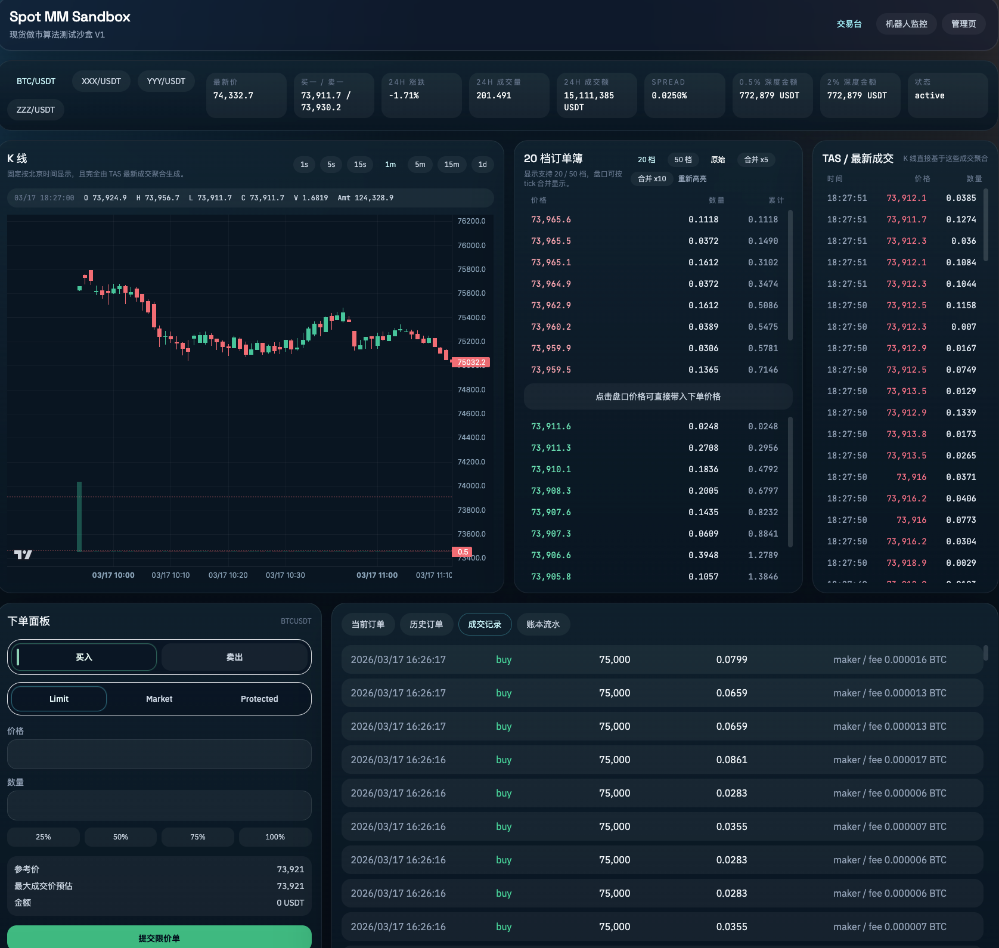
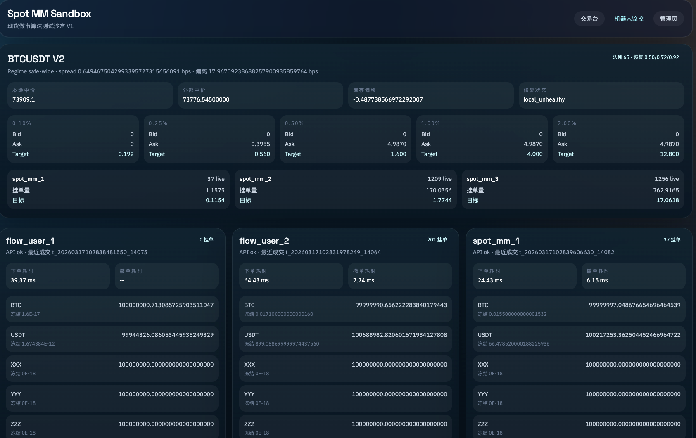

# Crypto-MM-Sandbox / 操盘手训练流动性模拟器

  

**An in-memory exchange matching engine & trading sandbox. Designed for quantitative algorithmic testing and manual trader training. Zero-config, out-of-the-box.**

**专为量化策略测试与手动操盘训练设计的纯内存撮合沙盒。零配置启动，开箱即用。**

### Preview | 效果预览

| 交易台 Trading Desk | 机器人监控 Bots Monitor |
|---------------------|--------------------------|
|  |  |

---

## 📖 Introduction | 项目简介

Traditional open-source exchanges are often too bloated (bundled with KYC, heavy databases, and complex microservices) for pure strategy testing. This project strips away the unnecessary, focusing entirely on **core matching mechanics and order book microstructures**.

市面上的开源交易所往往过于臃肿（绑定了 KYC、沉重的数据库和复杂的微服务），不适合纯粹的策略回测。本项目剥离了所有冗余模块，将核心完全聚焦于**撮合机制与盘口微观结构**。

Whether you are a quant testing a market-making algorithm's resilience against toxic flow, or a manual trader practicing tape-reading and execution under extreme volatility, this sandbox provides a pure, deterministic, and highly observable environment.

无论你是测试做市算法在极端冲击下抗风险能力的量化工程师，还是训练盘感和执行力的手动操盘手，这个沙盒都能为你提供一个纯净、确定且高度可观测的实战环境。

---

## ⚡ Core Features | 核心特性

### 1. In-Memory Matching Engine | 纯内存撮合引擎

- **True Queue Priority:** Supports O(1) atomic amends. Reducing order size keeps queue priority, while modifying price triggers an atomic cancel-replace.
- **真实排队优先级**：支持 O(1) 原子改单。同价减量严格保留排队优先级，改价/增量触发原子撤换，行为与真实顶级交易所一致。

### 2. Zero Fake Volume | 拒绝虚假成交

- Kline (Candlestick) charts and order book depths are 100% driven by **real matched orders**.
- **无虚假成交**：所有成交由真实订单簿撮合产生，不做自成交刷量。环境会对你的挂单、吃单流做出最真实的物理反馈。

### 3. Trader & Quant Friendly | 操盘手与量化友好

- **Manual Trading UI:** A clean frontend for traders to execute limit/market orders and practice tape-reading.
- **Comprehensive API:** Full REST and WebSocket support for algorithmic bots.
- **手动操盘训练**：提供简洁的前端交易界面，支持限价单、市价单、保护价市价单，方便交易员训练盘口微观体感。
- **完善的扩展性**：提供完整的 REST 和 WebSocket 接口，详见 [docs/机器人API对接手册.md](docs/机器人API对接手册.md)。

### 4. Minimalist Deployment | 极简部署

- **Zero Infrastructure:** No Docker, PostgreSQL, or Redis required. SQLite by default.
- **One-Click Start:** `run_sandbox.py` handles venv, dependencies, migrations, and launches frontend + backend.
- 零基础设施依赖，一键启动，可选 `--use-local-pg` 或 `--use-docker-infra` 升级。

---

## 🚀 Quick Start | 5分钟快速开始

### Prerequisites | 环境要求

- Python 3.10+
- Node.js 18+

*(Default uses SQLite, no Docker, PostgreSQL, or Redis required. / 默认使用 SQLite，无需 Docker 及复杂中间件)*

---

### 🪟 Windows 用户专属指南（零基础友好）

> 如果你用的是 Windows 且不熟悉命令行，请按以下步骤操作。全程只需「下载 → 安装 → 双击」，无需编程知识。
>
> **一句话总结**：装好 Python + Node.js → 下载 ZIP 解压 → 双击 `run.bat` → 浏览器打开 http://localhost:5173

#### 第一步：安装 Python（约 2 分钟）

1. 打开浏览器，访问 **https://www.python.org/downloads/**
2. 点击黄色按钮 **Download Python 3.x.x**
3. 下载完成后，**双击**安装包运行
4. ⚠️ **重要**：在安装界面**勾选**底部的 **"Add Python to PATH"**（若不勾选，后续双击 run.bat 会报错），然后点击 **"Install Now"**
5. 安装完成后点击 **"Close"**

#### 第二步：安装 Node.js（约 2 分钟）

1. 打开浏览器，访问 **https://nodejs.org/**
2. 下载 **LTS 版本**（左侧绿色按钮）
3. 双击安装包，一路 **Next** 即可，默认选项即可
4. 安装完成后**重启一次电脑**（或关闭所有已打开的终端窗口）

#### 第三步：获取项目文件

**方式 A：直接下载 ZIP（推荐，最简单）**

1. 打开 **https://github.com/polymarket01/trading-sandbox-simulator**
2. 点击绿色 **Code** 按钮 → 选择 **Download ZIP**
3. 下载完成后，右键 ZIP 文件 → **解压到当前文件夹**
4. 进入解压后的文件夹（可能叫 `trading-sandbox-simulator` 或 `trading-sandbox-simulator-main`，都可以）

**方式 B：已安装 Git 的用户**

在任意文件夹空白处，按住 **Shift + 右键** → 选择「在此处打开 PowerShell 窗口」，输入：

```powershell
git clone https://github.com/polymarket01/trading-sandbox-simulator.git
cd trading-sandbox-simulator
```

#### 第四步：一键启动

1. 进入 `trading-sandbox-simulator` 文件夹
2. **双击** `run.bat` 文件
3. 首次运行会自动下载依赖（约 1～3 分钟），请耐心等待
4. 看到 `[runner] 已启动` 后，打开浏览器访问：**http://localhost:5173**

#### 第五步：关闭与卸载

- **关闭**：在黑色命令行窗口按 **Ctrl + C**，或直接关闭窗口
- **卸载**：直接删除整个 `trading-sandbox-simulator` 文件夹即可，无残留

---

#### ❓ Windows 常见问题

| 问题 | 解决方法 |
|------|----------|
| 双击 `run.bat` 闪退 | 检查是否已安装 Python 和 Node.js，并**重启电脑**后再试 |
| 提示「python 不是内部或外部命令」 | 安装 Python 时未勾选 "Add Python to PATH"。解决：卸载 Python 后重新安装，**务必勾选** "Add Python to PATH" |
| 端口被占用 | 关闭其他占用 5173/5174 的程序，或重启电脑 |
| 想运行 K 线机器人 | 沙盒启动后，**再双击** `run_bot.bat` 即可 |

---

### Mac / Linux 用户 | Installation & Run

```bash
# 1. Clone the repository | 克隆仓库
git clone https://github.com/polymarket01/trading-sandbox-simulator.git
cd trading-sandbox-simulator

# 2. Run the magic script | 一键拉起沙盒
python3 run_sandbox.py
```

- 🌐 **Frontend UI (交易台):** http://localhost:5173
- 🔌 **Backend API Docs (接口文档):** http://localhost:5174/docs

### 🤖 Built-in Bots | 让 K 线动起来（可选）

To help you get started with a populated order book, this repository includes a minimalist liquidity bot.

启动沙盒后，系统默认订单簿是空的。你可以**另开一个窗口**运行极简买一卖一机器人，为 BTC 提供基础盘口挂单：

| 系统 | 操作 |
|------|------|
| **Windows** | 沙盒已运行后，**双击** `run_bot.bat` |
| **Mac / Linux** | 另开终端执行 `python3 top_of_book_bot.py` |

```bash
# Mac / Linux 用户
python3 top_of_book_bot.py
```

> 💡 **Play around:** Once the bot is running, place Market Orders on the frontend to interact with the bot's liquidity. You will see the K-line charts update in real-time!
>
> **互动演示：** 运行机器人后，在交易页用市价单与机器人的挂单成交，即可看到 K 线实时更新。

### 💡 Portable & Clean Uninstall | 绿色运行与一键卸载

本沙盒遵循严格的**环境隔离（Sandbox Isolation）**设计，对本机系统「零污染」：

- **自动化环境隔离**：脚本会在项目内自动创建 Python 虚拟环境 (`backend/.venv`) 并局部安装前端依赖 (`frontend/node_modules`)，绝不污染全局包。
- **单文件数据库**：默认使用 SQLite 单文件数据库，数据全部存放在 `backend/data/` 文件夹中，不注册任何系统底层服务。
- **全平台原生兼容**：Windows 用户双击 `run.bat` 即可，无需 WSL2；Mac/Linux 执行 `python3 run_sandbox.py`。

🗑️ **如何卸载？**  
无需专门的卸载程序。关闭运行窗口后，**直接删除 `trading-sandbox-simulator` 整个文件夹即可彻底清理**。不留任何缓存、注册表或系统垃圾。

---

## 📂 Directory & Accounts | 目录与预置账户

### Directory Structure | 目录结构

```
backend/           # FastAPI + Matching Engine + Data Layer
frontend/          # React Trading Desk UI
scripts/           # Initialization scripts
run_sandbox.py     # One-click starter
run.bat            # Windows 双击启动沙盒
run_bot.bat        # Windows 双击启动 K 线机器人
top_of_book_bot.py # Minimalist Top-of-Book liquidity bot
```

### Preset Accounts | 预置测试账户

| Username | Role | API Key | API Secret |
|---------|------|---------|------------|
| spot_manual_user | 手动交易 | `manual-demo-key` | `manual-demo-secret` |
| spot_mm_1 ~ 10 | 机器人账户 | `mm1-demo-key` ~ `mm10-demo-key` | 对应 `mm*-demo-secret` |
| spot_admin | 管理账户 | `admin-demo-key` | `admin-demo-secret` |

*(Note: Test funds can be reset to 100M USDT / 100M BTC via the Admin Panel. / 默认可在管理页「一键重置全部测试账户」恢复测试资金)*

---

## 🛠️ Tech Stack | 技术栈

| Layer | Stack |
|-------|-------|
| Backend | Python, FastAPI, SQLAlchemy 2.x, Alembic, asyncio |
| Frontend | React 19, Vite, TypeScript, TailwindCSS, Zustand, lightweight-charts |
| Database | SQLite (default), scalable to PostgreSQL |

---

## 📝 License | 许可证

This project is licensed under the MIT License - see the [LICENSE](LICENSE) file for details.

可自由使用和修改。
